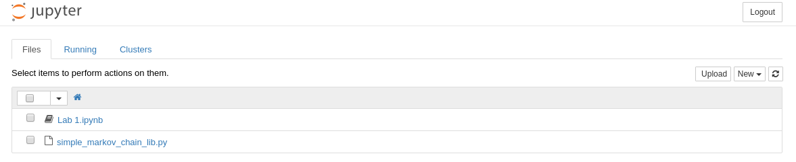
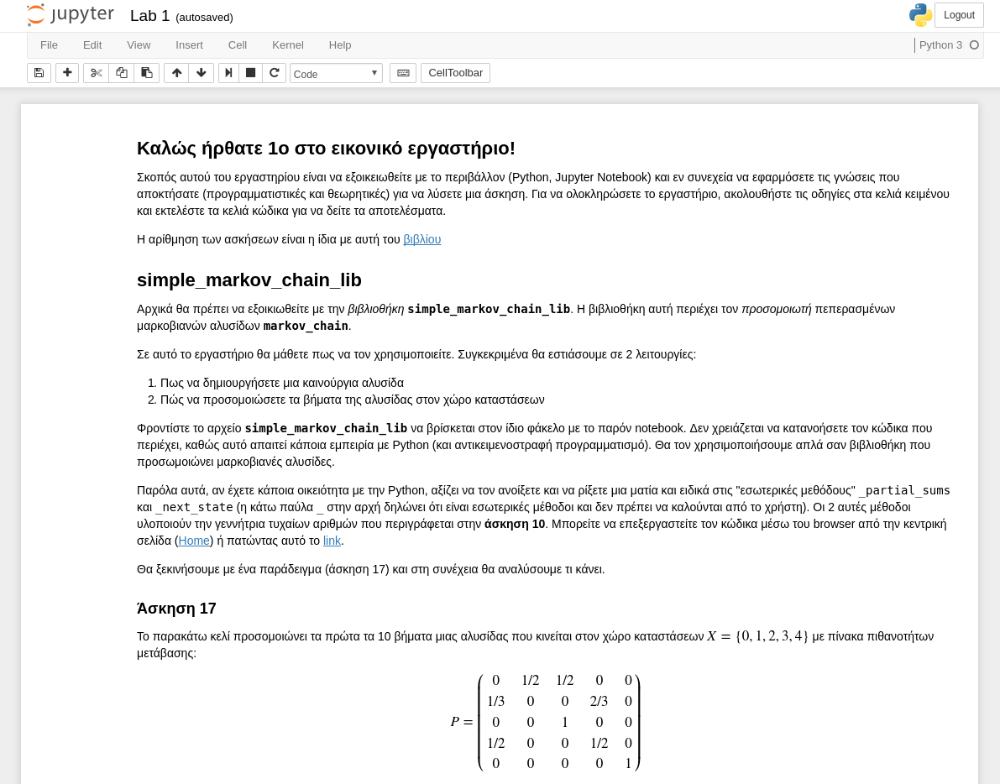
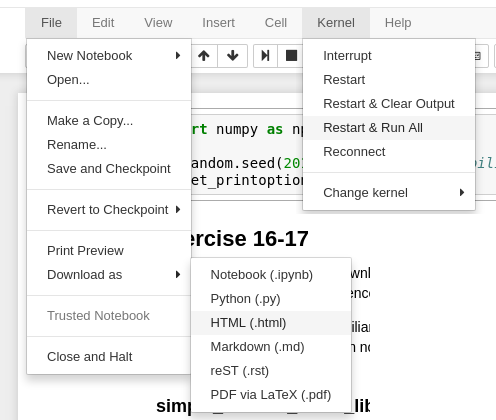

## Περίληψη

Αυτές οι οδηγίες αφορούν το μάθημα "Στοχαστικές Ανελίξεις" των
σχολών ΣΕΜΦΕ και ΣΗΜΜΥ του ΕΜΠ. Οι διδάσκοντες καθηγητής είναι οι
[Μιχαήλ Λουλάκης](http://www.math.ntua.gr/~loulakis/info/Home.html) 
και Αριστείδης Δούμας. Σε αυτές τις οδηγίες περιγράφεται το λογισμικό
που πρέπει να εγκαταστήσετε ώστε να δουλέψετε τις ασκήσεις. 

Για να αναφέρετε απορίες ή προβλήματα σχετικά με την εγκατάσταση 
και χρήση του λογισμικού χρησιμοποιήστε αυτό το 
[forum](https://github.com/TeoSakel/NTUA_Stochastic_Processes/issues?utf8=%E2%9C%93&q=).
Για να ανοίξετε καινούργια συζήτηση χρειάζεται να έχετε Github-account.
Αν έχετε πρόβλημα να συνδεθείτε στο forum, στείλτε email
στο stochproc.tech@gmail.com για τεχνική βοήθεια.
Για απορίες σχετικά με τις ασκήσεις απευθυνθείτε στον κ. Λουλάκη.

Οι ασκήσεις είναι γραμμένες σε μορφή *Jupyter Notebook*. Το
*Jupyter Notebook* είναι μια εφαρμογή που επιτρέπει τον συνδυασμό
κειμένου και κώδικα στο ίδιο αρχείο έτσι ώστε η παρουσίαση των
προβλημάτων και των λύσεων να είναι πλήρης και αυτάρκης. Για να
χρησιμοποιήσετε την εφαρμογή και για να δουλέψετε τις ασκήσεις
απαιτούνται τα παρακάτω λογισμικά.

- Γλώσσα προγραμματισμού **Python 3**
- Οι βιβλιοθήκες **Numpy** και **Matplotlib**
- Η εφαρμογή **Jupyter Notebook**

Για την εγκατάσταση και ολοκλήρωση των ασκήσεων χρειάζονται μερικές
επιπλέον βιβλιοθήκες αλλά δεν θα σας ζητηθεί να αλληλεπιδράσετε με αυτές.


## Εγκατάσταση

### Προτεινόμενη μέθοδος

Ο προτεινόμενος και ευκολότερος τρόπος να εγκαταστήσετε τα πάντα
είναι μέσω της [Anaconda](https://www.continuum.io/downloads).
Η Anaconda είναι μια ειδική έκδοση της Python προσαρμοσμένη για χρήστες που
κάνουν ανάλυση δεδομένων (data scientists). Για να εγκαταστήσετε την
Anaconda, πρέπει να ακολουθήσετε αυτό το [link](https://www.continuum.io/downloads)
και να επιλέξετε τον installer της **Python 3** (όχι 2!) που αντιστοιχεί στο
λειτουργικό σύστημα σας (Windows, Mac, Linux).

### Εναλλακτικές μέθοδοι

Εναλλακτικά αν δεν θέλετε να εγκαταστήσετε την Anaconda, πρέπει να:

1. Εγκαταστήσετε την [Python 3](https://www.python.org)
2. Εγκαταστήσετε τις βιβλιοθήκες που αναφέρονται
[εδώ](https://github.com/TeoSakel/NTUA_Stochastic_Processes/blob/master/requirements.txt)


Αν το λειτουργικό σας σύστημα είναι OSX ή GNU/Linux τότε ο ευκολότερος
τρόπος να τα εγκαταστήσετε όλα είναι μέσω του package manager που σας
παρέχει. Για Mac επειδή το OSX δεν έχει προεγκατεστημένο package
manager, συνιστούμε τη χρήση του [HomeBrew](https://brew.sh).

Τέλος αν δεν μπορείτε να χρησιμοποιήσετε τον package manager του
συστήματος σας (επειδή δεν υπάρχει ή δεν είστε διαχειριστής),
μπορείτε να χρησιμοποιήσετε το [pip](https://docs.python.org/3/installing/) 
που είναι ο package manager της Python. Για να εγκαταστήσετε το pip ακολουθείστε 
τις οδηγίες [εδώ](https://pip.pypa.io/en/stable/installing/).
Προφανώς για να χρησιμοποιήσετε το pip χρειάζεται να έχετε ήδη εγκαταστήσει
(με κάποιο τρόπο) την Python 3. 
Οι παρακάτω εντολές εγκαθιστούν όλα τα πακέτα που χρειάζονται:

```shell
# if you only have Python3 then you can write just python
python3 -m pip install -r requirements.txt
# or if you don't have admin rights
python3 -m pip install --user -r requirements.txt
```

## Τρόπος Λειτουργίας Εργαστηρίου

Το εργαστήριο είναι εικονικό. 
Οι ασκήσεις θα ανεβαίνουν ως Εργασίες στο mycourses ή 
μπορείτε να τις βρείτε και από
[εδώ](https://www.github.com/TeoSakel/NTUA_Stochastic_Processes), για να
τις κατεβάσετε πατήστε το `Clone or Download` (Fig \ref{CoD}) (δεξιά πάνω από τη λίστα με
αρχεία) και επιλέξτε `Download ZIP` (Fig \ref{ZIP}).


Για κάθε άσκηση, θα σας δίνεται ένα *Jupyter Notebook* (`.ipynb` αρχείο) 
που θα πρέπει να συμπληρώσετε. Μέσα στο notebook, θα
περιγράφεται κάποιο πρόβλημα και (συνήθως) θα υπάρχει κάποιο δείγμα κώδικα.
Σκοπός σας είναι να χρησιμοποιήσετε τις δυνατότητες του notebook ώστε να
τροποποιήσετε των κώδικα και να απαντήσετε στις ερωτήσεις που σας δίνονται.

Στο υπόλοιπο αυτών των οδηγιών θα σας περιγράψουμε συνοπτικά την
φιλοσοφία αυτού του εργαλείου, θα σας εξηγήσουμε τον τρόπο με τον οποίο πρέπει
να απαντάτε τις ερωτήσεις. Τέλος θα σας υποδείξουμε κάποιες πηγές από τις
οποίες μπορείτε να μάθετε τις τεχνικές δεξιοτεχνίες που απαιτούνται για να απαντήσετε.

---

### Python

Η γλώσσα που θα χρησιμοποιήσουμε για αυτό το εργαστήριο είναι η
[Python 3](https://www.python.org). Η Python είναι μια πάρα πολύ δυνατή γλώσσα 
με μεγάλη αποδοχή από την επιστημονική κοινότητα.
Για αυτό το εργαστήριο εκτός από τις βασικές δυνατότητες
της Python θα χρειαστεί να χρησιμοποιήσετε και 2 από τις πιο δημοφιλής
επιστημονικές βιβλιοθήκες της:

1. [Numpy](http://www.numpy.org/) για αριθμητικό προγραμματισμό
2. [Matplotlib](http://matplotlib.org/) για την οπτικοποίηση των αποτελεσμάτων.

Αν δεν γνωρίζετε Python (ή κάποια από τις 2 βιβλιοθήκες) δεν χρειάζεται
να απογοητεύεστε καθώς η Python έχει σχεδιαστεί με σκοπό να είναι ευανάγνωστη
και εύκολη στην εκμάθηση. Αν ενδιαφέρεστε να προχωρήσετε τις δεξιότητές σας 
πέρα από τις ανάγκες του εργαστηρίου, μπορείτε να παρακολουθήσετε
τα 2 διαδικτυακά μαθήματα που παρέχονται δωρεάν από το [DataCamp](https://www.datacamp.com)

1. [Intro to Python](https://www.datacamp.com/courses/intro-to-python-for-data-science)
2. [Intermediate Python](https://www.datacamp.com/courses/intermediate-python-for-data-science)

Η Python είναι μια *interpreted language* οπότε μπορείτε εύκολα να πειραματιστείτε.
Αν θέλετε ένα διαδραστικό τερματικό για να δοκιμάσετε τις ιδέες σας, σας συνιστούμε
το [IPython](https://ipython.org/). Έχετε υπόψη ότι για την παράδοση των ασκήσεων πρέπει
να γράψετε κώδικα Python σαν μέρος ενός Jupyter Notebook.

### Markdown (κελιά κειμένου)

Οι ασκήσεις εκτός από κώδικα απαιτούν να απαντήσετε και μερικές ερωτήσεις κρίσεως.
Γι αυτό το λόγο (και για να εξηγήσετε καλύτερα τις σκέψεις και την υλοποίηση τους)
χρειάζεται να γράψετε ελεύθερο κείμενο. Για να διαμορφώσετε το κείμενο σας σωστά,
(με τίτλους, στοιχειά έμφασης και λίστες), θα πρέπει να χρησιμοποιήσετε την σύνταξη
**markdown**.

Το **markdown** είναι μια σύνταξη που σχεδιάστηκε με σκοπό να είναι εύκολη στην
εκμάθηση, και εύκολα μεταφράσιμη σε άλλες (πιο πλούσιες) μορφές κειμένου. 
Από όλα όσα χρειάζεται να μάθετε για αυτό το εργαστήριο το markdown
απαιτεί την λιγότερη πνευματική άσκηση!

Μία σύντομη περιγραφή όλων των δυνατοτήτων που θα χρειαστείτε για το εργαστήριο
δίνεται σε αυτό τον σύνδεσμο: [https://goo.gl/PTQGn6](https://goo.gl/PTQGn6) 
(παρατηρείστε ότι υπάρχει επιπλέον σύνδεσμος που οδηγεί στο βίντεο που περιγράφει το κείμενο).
Για επιπλέον παραδείγματα μπορείτε να δείτε
[εδώ](https://guides.github.com/features/mastering-markdown/) και
[εδώ](https://github.com/adam-p/markdown-here/wiki/Markdown-Cheatsheet).

### Jupyter Notebook

Σε αυτό τον [σύνδεσμο](https://youtu.be/HW29067qVWk) 
μπορείτε να δείτε ένα εισαγωγικό βίντεο για τη χρήση του notebook.

Το *Jupyter Notebook* είναι μια εφαρμογή που επιτρέπει την δημιουργία και διανομή
αρχείων που περιέχουν κώδικα, εξισώσεις, εικόνες μαζί με το κείμενο που τα εξηγεί.
Είναι οργανωμένο σε *"κελιά"* (cells). Κάθε κελί μπορεί να είναι είτε κελί κειμένου,
στο οποίο μπορείτε να εξηγήσετε τι κάνετε, όπως και "γιατί" ή "πώς" το κάνετε. Στα
κελιά αυτά γράφετε σύμφωνα με την σύνταξη [markdown](#Markdown) 
(βλέπε παρακάτω για λεπτομέρειες). Στα κελιά κώδικα, γράφετε κώδικα 
[Python](#Python) (βλέπε παρακάτω). Όταν "εκτελέσετε" το κελί ο κώδικας αυτός 
εκτελείτε και τα αποτελέσματα του, αν είναι εμφανή, τυπώνονται ακριβώς από κάτω. 
Ό,τι υπολογίζεται σε ένα κελί είναι διαθέσιμο σε όλα τα μετέπειτα κελιά 
(το namespace είναι ενιαίο για όλα τα κελιά).

Για να ξεκινήσετε να δουλεύετε τις ασκήσεις πρέπει να ανοίξετε το notebook μέσα
στο φάκελο που περιέχει τα `.ipynb` αρχεία. Υπάρχουν πολλοί τρόποι να το κάνετε αυτό,
όπως για παράδειγμα:

- Με χρήση **terminal**:
  1. Ανοίχτε το terminal (για Windows που έχουν εγκαταστήσει την Anaconda,
  ανοίχτε το *Anaconda prompt*)
  2. Πλοηγηθείτε στο φάκελο που έχει τα notebooks (`cd path/to/folder`)
  3. Δώστε την εντολή `jupyter notebook`

- Με χρήση **Anaconda Navigator** (Windows και OSX).
  1. Τρέχτε το Anaconda Navigator
  2. επιλέξτε την εφαρμογή *Jupyter Notebook*
  3. Στο παράθυρο του browser που ανοίγει πλοηγηθείτε στο φάκελο με τα notebooks

- Με **Windows Shortcut** (μόνο για Windows με Anaconda):
  1. Βρείτε την εφαρμογή *Jupyter Notebook* στη γραμμή εκκίνησης
  2. Αντιγράψτε την στην επιφάνεια εργασίας
  3. Κάντε δεξί-κλικ στο νέο εικονίδιο και συμπληρώστε στο πεδίο *Start in* το
  μονοπάτι για το φάκελο που περιέχει τα notebooks.

Όταν ξεκινήσετε το notebook ένα καινούργιο παράθυρο ή καρτέλα (tab) θα ανοίξει
στον φυλλομετρητή (broswer) της επιλογής σας (Fig \ref{main_page}). Αν δεν συμβεί αυτό ή κατά λάθος
κλείσετε το παράθυρο τότε μπορεί να το ξαναβρείτε πηγαίνοντας στης διεύθυνση:
[http://localhost:8888/](http://localhost:8888/). 




Άμα ακολουθήσετε σωστά τις οδηγίες θα πρέπει να δείτε
μία λίστα με τα διαθέσιμα αρχεία. Κάνοντας διπλό-κλικ στο αρχείο της άσκησης
που θέλετε να δουλέψετε, μια καινούργια καρτέλα με την περιγραφή της άσκησης θα
εμφανιστεί και εκεί μπορείτε να δουλέψετε (Fig \ref{exercise}).



---

## Παράδοση Εργασιών

Όταν είστε ικανοποιημένοι με το αποτέλεσμα της δουλειάς σας, τότε πρέπει:

1. Να τρέξετε ξανά όλο το notebook από την αρχή για να σιγουρευτείτε ότι δουλεύει
(`Kernel > Restart & Run all`)
2. Να σώσετε το notebook σαν αρχείο `html` (`File > Download as... > HTML`)
3. Να ανεβάσετε **εμπρόθεσμα** το `HTML` αρχείο στον [mycourses]()



